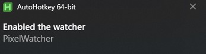

# Pixel Watcher

Basic script to monitor a specific pixel on your screen. You can perform different actions depending on the detected colour. Can be used for basic game automation or low quality motion detection (with minor changes).

- just a quick proof of concept
- use at your own risk
- more info can be found in the [AHKv2 documentation](https://www.autohotkey.com/docs/v2/)
- check the [AHK forums](https://www.autohotkey.com/boards) if you need help

## Requirements

- [AHKv2](https://www.autohotkey.com)
- text editor

## Recommendations for Development

- you can use [scoop](https://scoop.sh/) to install AHK
  - `scoop install autohotkey`
- if notepad is not enough
  1. get [VSCode](https://code.visualstudio.com/) for syntax highlighting and formatting
  2. get the extension [AutoHotkey v2 Language Support](https://marketplace.visualstudio.com/items?itemName=thqby.vscode-autohotkey2-lsp)
  3. add AHK interpreter path to your extension config
  4. run and compile scripts directly from VSCode's command palette
- you can compile your finished script to a binary with Ahk2Exe
